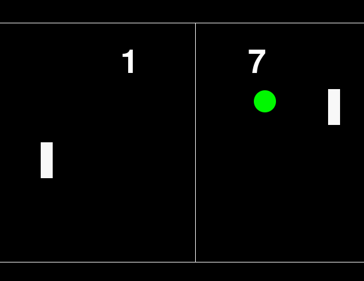

# Pypong
a Pong clone written in Python and Pygame

# How to launch the game
To launch the game, you well need the Python programming language, and the Pygame librairies. Python can be located
[Here](https://www.python.org/downloads/release/python-2712/), and Pygame, can be downloaded from [here](http://www.pygame.org/download.shtml). **DO NOT GRAB 3.(point)
ANYTHING**

# Credits
Sound is from [freesound.org](https://freesound.org). Specifically, [this guy, mickdow](http://freesound.org/people/mickdow/sounds/177409/)
